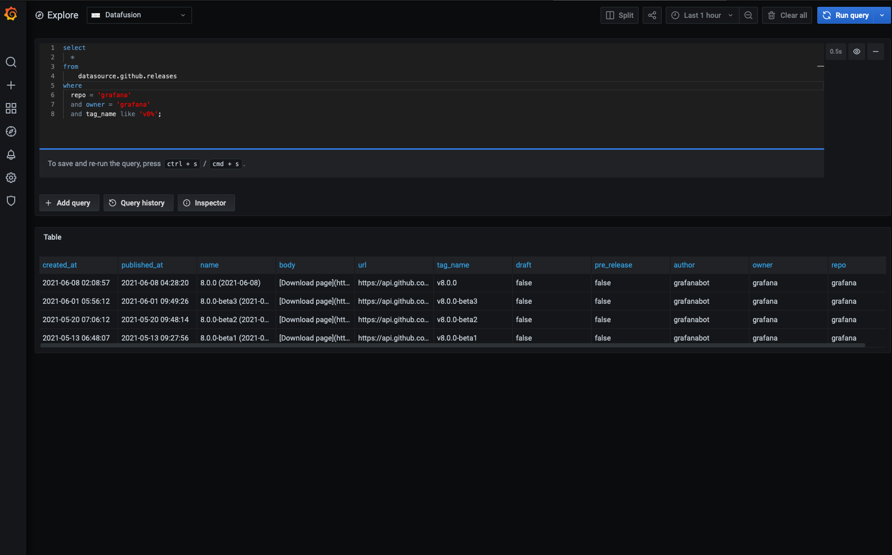

# Grafana Rust Data Source

This is the result of an experiment that uses [arrow-datafusion](https://github.com/apache/arrow-datafusion) as a datasource.

You will need the following dependencies installed:
* Docker
* node v14
* yarn

To install the rest of the dependencies, you can run:
```
make setup
```

Start grafana:
```
make start
```

## Example 

You can find an example of implementing a datasource [here](crates/datafusion-test-datasource/pkg/github/releases.rs).



Example `releases` query:
```sql
SELECT 
  date_trunc('week', published_at) AS week,
  count(name) AS release_count
FROM 
  datasource.github.releases
WHERE
  owner = 'grafana'
  AND repo = 'tempo'
GROUP BY week
ORDER BY week ASC
```

Example `pull_requests` query:

```sql
SELECT 
  date_trunc('week', created_at) AS week,
  count(*) AS pr_count
FROM 
  datasource.github.pull_requests
WHERE
  owner = 'grafana'
  AND repo = 'tempo'
GROUP BY week 
ORDER BY week ASC
```