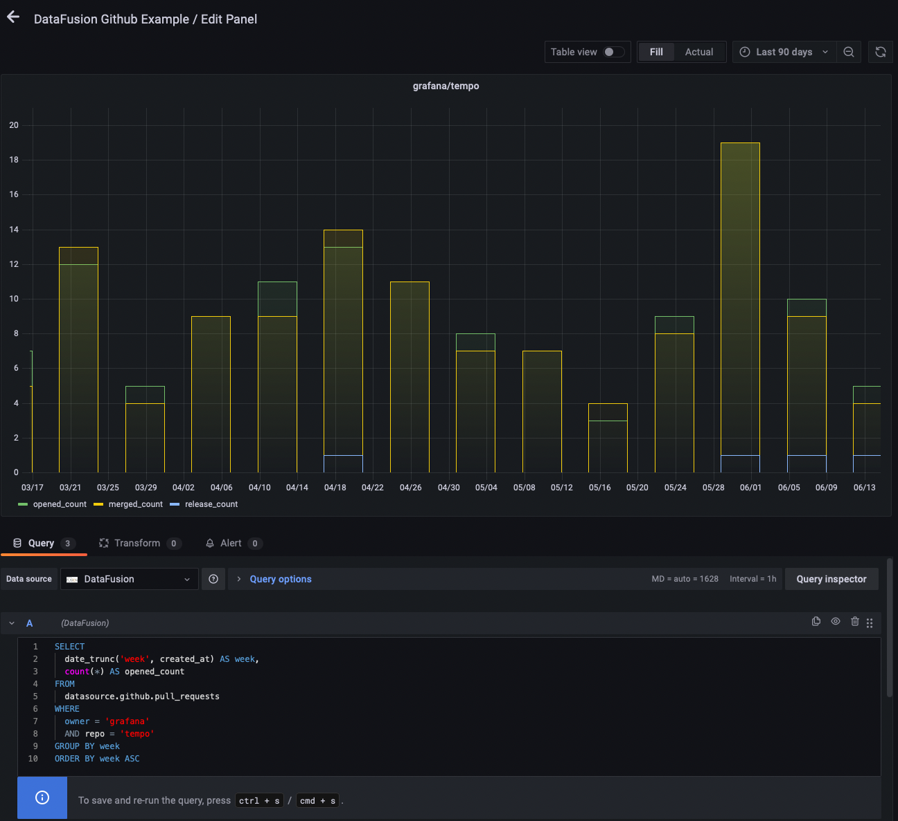

# Grafana Rust DataFusion Data Source

This is the result of an experiment that uses [arrow-datafusion](https://github.com/apache/arrow-datafusion) as a datasource.

```
make ui
make dist/gpx_datafusion_linux_amd64
```

## Example 

You can find an example of implementing a datasource [here](crates/datafusion-test-datasource/pkg/github/releases.rs).



Example query:
```sql
select
  * 
from 
    datasource.github.releases 
where 
  repo = 'grafana' 
  and owner = 'grafana'
  and tag_name like 'v8%';
```